# WW1 Tank Avoidance

## Demo
Demo Video: <URL>

## GitHub Repository
GitHub Repo: https://github.com/Xiaomi-Bread/Final-Project.git

## Description
Hi I am Alan, a freshman at UTD. This is my final project for my ANGM course: Programming for Digital Arts (ANGm 2305). I will present you a game that I wanted to make to start my careers in games develop. I called it : Ww1 Tank Avoidance. This project as taken me some time to plan but at the end I was able to produce this solo game. With me being the main artist and the progammer

## WW1 Tank Avoidance: Descripition 
As the name suggest you are playing as a commander of a WW1 Tank called the Mark IV in the heat of the first World War. You are ordered to storm the trenches along with your 4 other crew memebers. In you assigned a Mark IV which is called the 503.
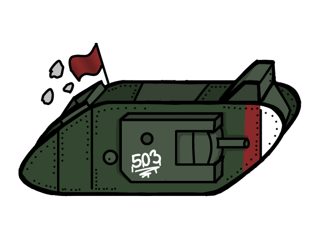
The tank looks very strange. However you don't mind and became to command your crew to charge into battle unknown what type of enemys awaits for you. 

Test your skills at dodging the incoming fires of the many anti-tank rifles, there scary artillery, and sneak spikes. The enemy will do anything to stop you. Let's see how many trenches you are able to pass until you stopped by the enemy or who knows you will keep going forever.

## Features
As you press "Start" you be brought into the screen where you will see your crew members. They are your health points. They are the ones keeping the tank going and operational. 

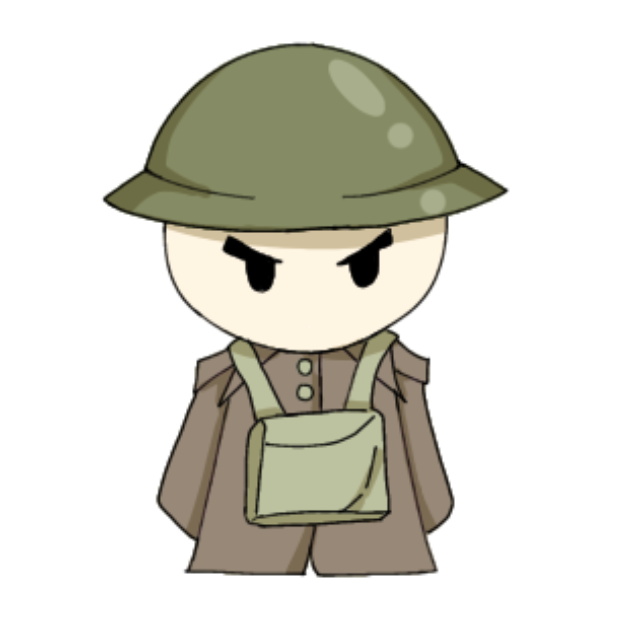

You have the ability to move up and down via the W and S button or the arrow keys on your keyword. The reason for this is you keep to control the tank from oncoming enemies. 

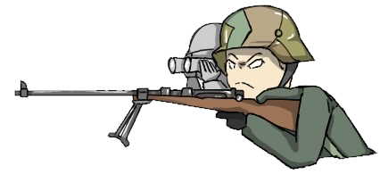
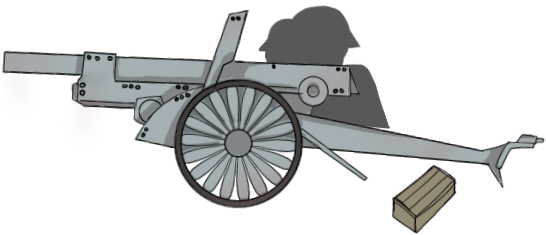

The enemies will be randomly spawn in the trenches and only fire at one direct. At you! So your job is to dodge them. As shown there is an anti-tank rifle opponents. They have the strength to penetrate the armor of the Mark IV, so therefore when you are hit why there bullets, one of your crew might go down. So be careful! 

Next we have the artillery. Like the anti-tank rifle. They are slower to fire but their firepower isn't. As getting hit by one will destory 2 of your crew. However you can avoid cause faith by dodging it and hearing a loud boom to dodge it in time. 

Lastly, there are spikes. (Not history accurate) They are placed there so that they have the change to pentrate the amor of a Mark IV on there smooth underbelly. Getting hit by one will destory one of your crew. They are also well hidden or hard to see. So keep an eye out for them .

As mentioned before your crew are the ones keeping your tank operational. If you lose all 4 of your crew your tank will be destory. This meaning your offensive is over and the game is over. Until you run the game as more. 

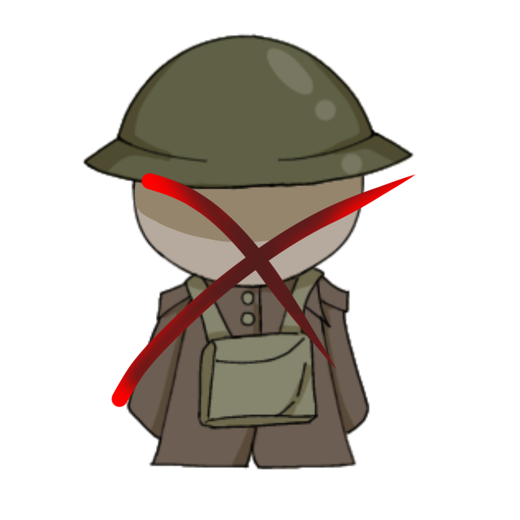

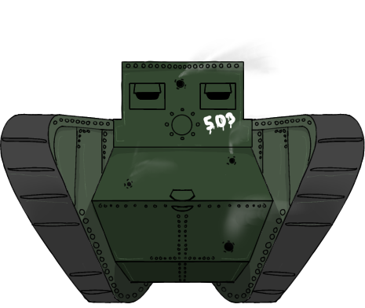

As lastly, there are trenches where all of the enemies are stationed (something the artillery). The enemies job is to prevent you from advantaging into to many trenches. So whenever you pass throught a trench you will get one point or how many trenches you have pass. Additionally they will be display as your career stats at the very end of your tank lifes. 

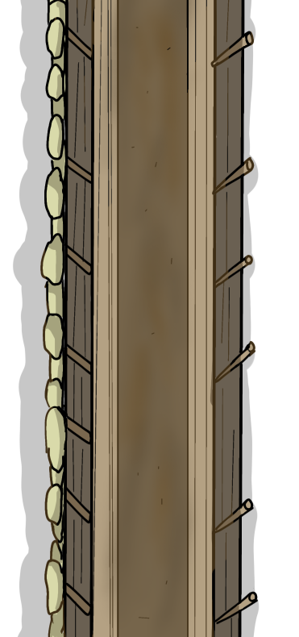

Lastly there is the enviroment. Whenever you enter the game you will be introducted to a different land. As shown we have the Nomansland, grassland, snowland, and desert. As those are the places where WW1's trench warfare as occured. 

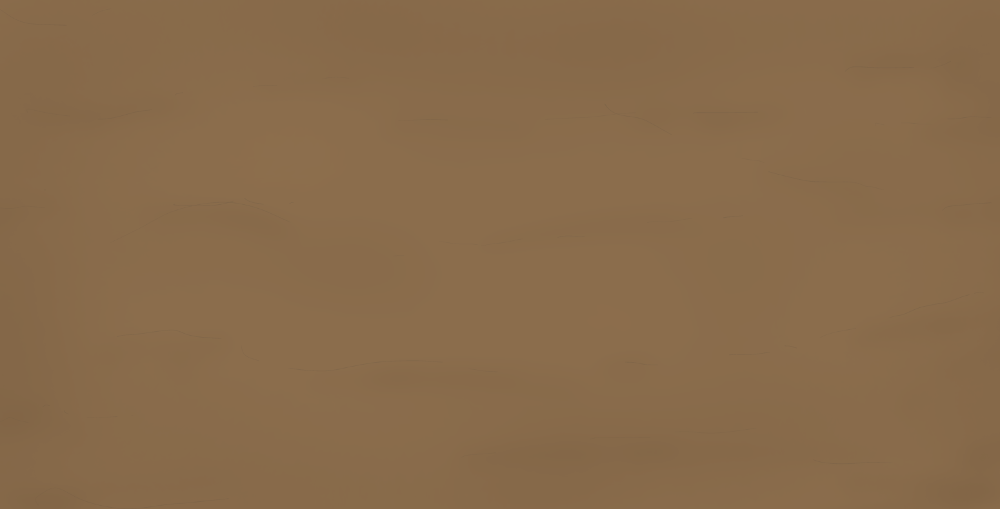

In addition to maps. You will also see many enviromental part of the maps. I have many features that are also common  in trench warfare. For example the barbedwired to prevent the enemies from getting too far, ouddles many from the constant fire of artilerys at each other, trees that are dead from all of the fighting that is going around and some have even fallen due to it 

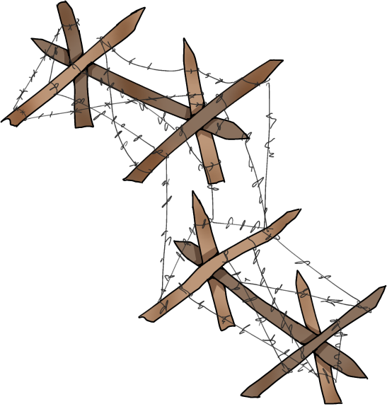
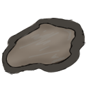
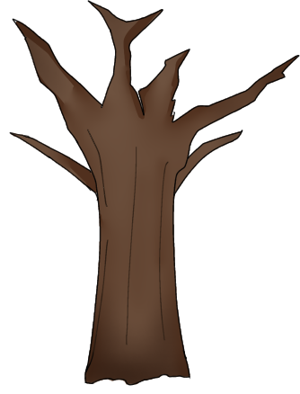
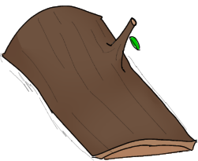

Those are all shown around the map as you enter farther into the enemy line. So have fun going playing and seeing the scenery as all of the art is done and I hope you do join the final project game as much fun as I was creating it!

## How to play
I don't know exactly how make it available for it to be you to download. However will the git rep link I have provided. Here is how you are able to play. 
1. Clone the URL Provided 
2. Go to the Terminal 
3. Type: cd src 
4. Then type:  py project.py(or Click on the Terminal Code)
5. Enjoy!

## Contributions
This Project was soley done by me. 

##Credits
Artist: Alan
Programer: Alan 